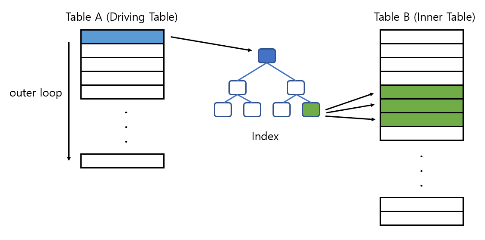

# 결합(Join) 알고리즘과 성능

1. Nested Loops Join
2. Hash Join
3. Sort Merge Join

## NESTED LOOP JOIN

- 1 (Outer): M (Inner)

- Inner Table에서 JOIN 컬럼이 인덱스에 걸려있지 않으면 굉장한 비효율이 발생한다.

- 대량의 데이터를 가진 테이블을 OLTP성 환경의 쿼리에서 유리함

## SORT MERGE JOIN

- join column을 기준으로 sorting을 시킨후 JOIN을 한다.

- Inner Table 쪽에 적절한 인덱스가 없어서 NESTED LOOP JOIN을 쓰기에는 비효율적일때 사용할 수 있다.

- 또는 Equal Join이 아니라 범위로 JOIN을 하는 경우에도 사용하는 것이 적절하다.

- sorting 작업이 PGA 영역에서 수행되기 때문에 경합이 발생하지 않아서 성능에 유리하다.

## HASH JOIN
